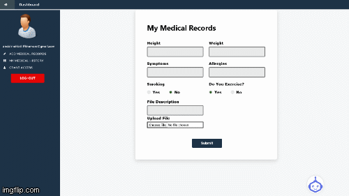
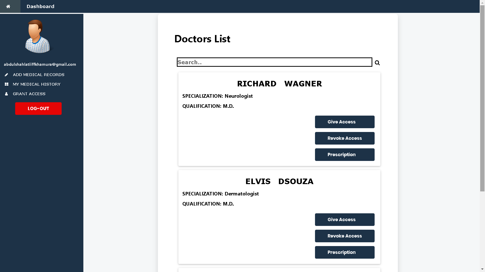
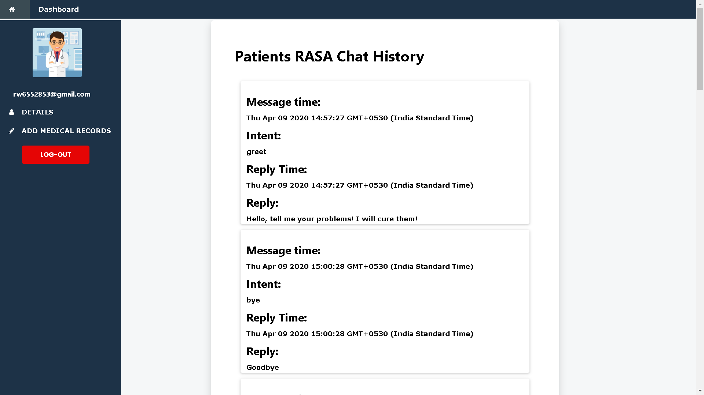

# EHR
Access control of medical records using BigchainDB & IPFS

# Table of Contents

* [Description](https://github.com/ejson03/EHR-On-Bigchain#description)
* [Dependencies](https://github.com/ejson03/EHR-On-Bigchain#dependencies)
* [Installation](https://github.com/ejson03/EHR-On-Bigchain#installation)
  * [Prerequisites](https://github.com/ejson03/EHR-On-Bigchain#prerequisites)
  * [Instructions](https://github.com/ejson03/EHR-On-Bigchain#instructions)
* [Usage](https://github.com/ejson03/EHR-On-Bigchain#usage)
* [Contributors](https://github.com/ejson03/EHR-On-Bigchain#contributors)
* [License](https://github.com/ejson03/EHR-On-Bigchain#license)

# Description

There is a rapid increase in generation of medical data especially in a situation of medical emergency or crisis. When hospitals are understaffed to maintain healthcare data, they are prone to be tampered with. Users do not recieve their medical information on time and cannot approach other institutions quickly with their medical history.

* Solution: Bring EHR to blockchain

BigchainDB is a decentralized database that has immutability just like traditional blockchains. We have attempted to develop an end to end system for succesful storage, transfer and tracking of patient healthcare data. All records are encrypted using AES-256 encryption and the access for this data is transferred through blockchain and assymetric cryptography. Due to limited blockchain data storage, files are being stored in IPFS.

A basic chatbot is also designed to avoid entering data manually into forms. Conversational history is tracked and stored on the blockchain too to maintain credibility of the chatbot performance.

### RASA Chatbot Plugin


### Patient Functions


### Asset History


### Chat History


More screenshots available * [here](https://github.com/ejson03/EHR-On-Bigchain/tree/master/images)

# Dependencies

* [BigchainDB](https://www.bigchaindb.com/)
* [IPFS](https://ipfs.io/)
* [Node.js](https://nodejs.org/en/)
* [npm](https://www.npmjs.com/)
* [Vagrant](https://www.vagrantup.com/)
* [VirtualBox](https://www.virtualbox.org/)

# Installation

### Prerequisites

Install Node.js and npm using the link above. Follow instructions on their respecive websites. Npm is included with Node.js
Also install Vagrant and VirtualBox

### Instructions

Clone the repository
```
git clone https://github.com/ejson03/EHR-On-Bigchain.git
```

Setup Vagrant
```
cd setup
vagrant up bigchaindb
vagrant ssh bigchaindb (prompt password: vagrant)
```

Clone and setup BigchainDB
```
git clone https://github.com/bigchaindb/bigchaindb.git
cd bigchaindb
sudo make run (first time)

sudo docker-compose start (when further encountered for development)
sudo docker-compose build (if bdb shows error)
```

Dashboard Setup
```
cd block-visualization
npm install
npm start
```
Chatbot Setup
```
rasa run actions
rasa run -m models --endpoint endpoints.yml --enable-api --cors “*” --debug --log-file out.log 
```

Change the url for MongoDB and BigchainDB appropriately with repect to your working environments

# Usage

Run the project
```
npm install
node server.js
```
Open a browser and go to 
```
http://localhost:8080
```
# Contributors

* Elvis Dsouza [@ejson03](https://github.com/ejson03)
* Vedant Sahai [@Vedantsahai18](https://github.com/Vedantsahai18)
* Pratik Chowdhury [@pratikpc](https://github.com/pratikpc)

# License

[](https://opensource.org/licenses/MIT)


